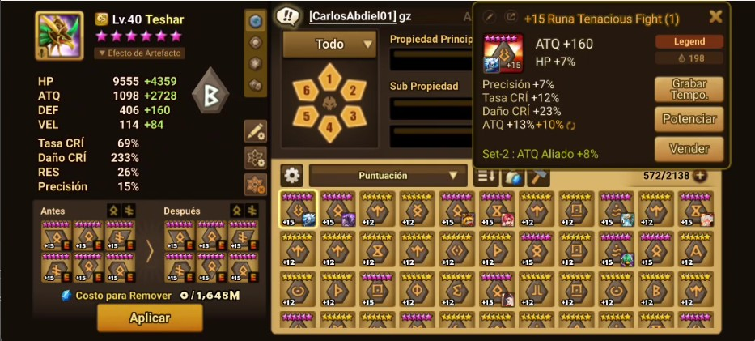
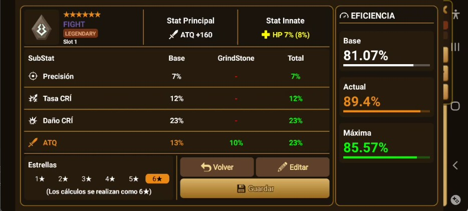

# SWRuneVault

## ✨ Características

- Gestión de runas
- Gestión de estadísticas y subestadísticas
- Cálculo de eficiencia
- Escaneo/lectura de runas
- Edición de substats
- Interfaz gráfica para visualizar la información

## 🛠️ Tecnologías

- Kotlin

## 📱 Capturas de pantalla

Pantalla principal del juego ejecutando el botón en superposición, para lanzar la lectura de la pantalla.

Pantalla de inventario dentro del juego junto el botón.

Ventana en superposición, ejecutando el análisis de la runa mostrada en la imagen anterior.

## 🚀 Instalación

1. Clona el repositorio.
2. Abre el proyecto en Android Studio.
3. Sincroniza las dependencias de Gradle.
4. Ejecuta la aplicación en un dispositivo o emulador.

## 📌 Estado del proyecto

En desarrollo.

## 📄 Licencia

SWRuneVault es software propietario.  
Todos los derechos están reservados por AngelNara2.

El código fuente puede ser consultado públicamente, pero su uso, modificación, reproducción y distribución no están permitidos sin autorización previa.
