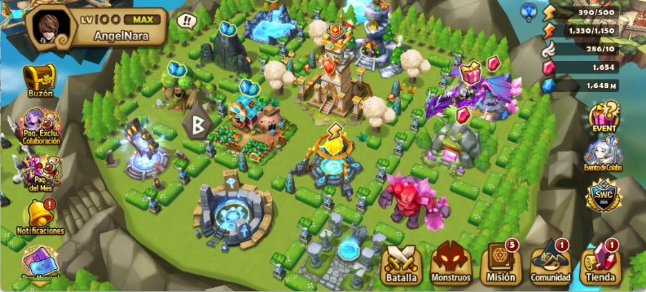

# SWRuneVault

## ✨ Características

- Gestión de runas
- Gestión de estadísticas y subestadísticas
- Cálculo de eficiencia
- Escaneo/lectura de runas
- Edición de substats
- Interfaz gráfica para visualizar la información

## 🛠️ Tecnologías

- Kotlin

## 📱 Capturas de pantalla

Pantalla principal del juego ejecutando el botón en superposición, para lanzar la lectura de la pantalla.

## 🚀 Instalación

1. Clona el repositorio.
2. Abre el proyecto en Android Studio.
3. Sincroniza las dependencias de Gradle.
4. Ejecuta la aplicación en un dispositivo o emulador.

## 📌 Estado del proyecto

En desarrollo.
